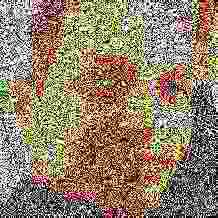

 [](https://github.com/blawar/GoldBricks/releases/latest) [](https://github.com/blawar/GoldBricks/releases/latest)

> GoldBricks is multipurpose homebrew tool for Nintendo Switch for those souls with the impure of heart.

# High Memory Requirement

There is not enough free memory left to add NSZ support in applet mode.  Therefore title installs will require that GoldBricks be ran in high memory mode via title override or a piracy NSP forwarder.

 

> Having any issues? Check [this help document](docs/FAQ.md) for help!

# Table of contents

1. [Features](#features)
2. [Disclaimer](#disclaimer)
3. [Nut and remote PC](#nut-and-remote-pc)
4. [GDrive Installs](#gdrive)
5. [Settings](#settings)
6. [Known bugs](#known-bugs)
7. [Contributing](#contributing)
8. [Credits and support](#credits-and-support)

## **[Download it from here!](https://github.com//blawar/goldbricks/releases)**

<p>
<a href="https://www.telefonodelaesperanza.org">https://www.telefonodelaesperanza.org</a>
<br>
<b>Do you like my work? Please donate if you would like to continue to receieve updates from me!</b>
</p>

## Features

GoldBricks has a very similar concept to [FBI](https://github.com/Steveice10/FBI), which is a similar tool for Nintendo 3DS homebrew.

These are its main features:

- **SD card browser**:  A simple but fully equiped file browser for the SD card, supporting several file formats (such as NSP, NRO, NACP, NXTheme, JPEG, tickets...), and with support for copying, pasting, renaming, deleting and creating files and directories.

- **Console memory browser**: Same browser but to be used with NAND partitions, which also warns when writing or deleting content as it can be dangerous.

- **Remote PC browser**: Via this feature, one can browse a PC's drives like any other filesystem, connected by a USB-C cable.

- **Content manager**: Browse any kind of content in your SD card, console memory or game cartridge. You can browse all the NCAs, and as title options, you can remove the content, or export it as a NSP. NAND SYSTEM contents (system titles or contents) aren't allowed to be deleted. Invidual contents such as updates or DLC can be removed individually. You have also the option to remove unused tickets or tickets belonging to contents, plus the options to reset launch version (in order to remove the update nag) or to export base, updates or DLCs to installable NSPs.

- **Web browser (console's web-applet)**: Using the console's web applets, GoldBricks allows to search and navigate through web pages. However, this can only be accessed if launched from the forwarder for technical reasons.

- **User account manager**: Select a user account, and easily change things as the user's nickname or even delete it. Via the file browsers you can replace a user's icon with a JPEG image, but it can be a risky action. The icon needs to be a valid JPEG, with 256x256 dimensions. GoldBricks checks if the icon is valid to replace the other one. Linked accounts can also be unlinked (locally).

- **Console or GoldBricks settings**: In this menu you can manage the console's update (view it's version or dump it as a directory installable with Choi or a NSP), and pending update in case it's present (auto-downloaded updates, which can also be viewed, dumped or deleted)

Among all this features, GoldBricks is a very intuitive tool, with a fancy UI, and fully translated into 5 different languages: **English**, **Spanish**, **German**, **French**, **Italian** and **Dutch**.

### Common controls

- **(LR-stick / R-stick / D-pad)** Move through the current menu

- **(ZL / ZR)** Show a dialog to shut down or reboot the console.

- **(Plus / +)** Show a dialog with this information.

#### NRO-only controls

- **(Minus / -)** Exit the application in order to return to hbmenu.

## Disclaimer

### NSP installs

Always keep in mind that installing NSPs can be a very easy way to get banned. If you use airplane mode and special DNSs like 90DNS, there is a smaller chance to get banned.

**NEVER** install untrusted NSPs. GoldBricks doesn't do any special verification, so please make sure that what you decide to install was obtained from trustworthy sources.

### Tickets

Tickets represent a game purchase, but technically speaking, you can't boot a title if the ticket isn't present (in case the title requires the ticket).

NSPs which don't have (nor require) a ticket are "standard crypto" NSPs. Standard-crypto titles aren't offical (usually reconverted content to avoid importing tickets).

GoldBricks will display whether a ticket is present or not, and if so, it's titlekey. Titlekeys are required to decrypt and access titles' content which require a ticket. Otherwise, they are undecryptable, hence unlaunchable by the system.

**TL;DR:** **Always** try to avoid untrusted NSPs, and if you go ahead and install CDN NSPs with tickets, avoid going online, or use special tools such as Incognito, or you'll be banned for sure.

## Nut and remote PC

Nut is a PC tool, with a fancy UI and made in Python, in order to help GoldBricks with the remote PC option. It should work on Windows, Linux, and Mac.

Nut can be downloaded here: <a href="https://github.com/blawar/nut">https://github.com/blawar/nut</a> .  Windows users can download the prepackaged exe, all other users should download master and run server.py.

**One time setup**:

1. Download [Zadig](https://zadig.akeo.ie/)

2. Open GoldBricks and connect your Switch via USB with your PC

3. Open Zadig

4. Click "Options" and select "List all devices"

5. Select the Switch from the drop-down menu

6. Change the driver (right next to the green arrow) to "libusbK"

7. Click on the button below "Install WCID Driver" or "Replace Driver"

8. Done. Now you can use GoldBricks and Nut to directly access your PC!

**Note:** To use it correctly, make sure you open GoldBricks and connect the Switch with your PC before you launch Nut. Nevertheless, Nut will warn when USB connection is gone or no USB connection is found.

# GDrive

To access GDrive, you must use Nut via USB, then access your PC through the gdrive folder in GoldBricks.  Team Drives are also supported.

## Settings

GoldBricks supports the customization of colors, assets and other options via a JSON file located at GoldBricks's folder: `sd:/switch/GoldBricks/settings.json`.

### Sample

This is an example JSON for GoldBricks settings:

```json
{
    "general": {
        "customLanguage": "es",
        "keysPath": "/switch/prod.keys",
        "externalRomFs": "/switch/GoldBricks/theme/rom"
    },
    "ui": {
        "background": "#aabbccdd",
        "base": "#aabbccdd",
        "baseFocus": "#aabbccdd",
        "text": "#aabbccdd",
        "menuItemSize": 80
    },
    "installs": {
        "ignoreRequiredFwVersion": false
    }
}
```

If a certain attribute isn't present GoldBricks will use default values. For colors, GoldBricks will initially load default light/dark themes according to the console's theme color, and later, colors present in the JSON will be used instead of default theme ones.

### Notes

Via RomFs replacement, when GoldBricks tries to locate, for instance, `romfs:/FileSystem/FileDataFont.ttf` resource font, if `romfsReplace` is true and `romfsReplacePath` is, for instance, `/switch/GoldBricks/testromfs`, GoldBricks will look if `sd:/switch/GoldBricks/testromfs/FileSystem/FileDataFont.ttf` exists and use it if so, otherwise will use RomFs's one.

So, via this configurations, UI's images, resources, element sizes and even translations (using custom JSON translations) can be used, plus some more assets which will be added in future updates.

## Known bugs

- Apparently, after browsing (more than 4 times?) and then browsing (specific?) empty directories crashes GoldBricks. This issue is strangely common and needs to be looked into.

## Contributing

If you would like to contribute with new features, you are free to fork GoldBricks and open pull requests showcasing your additions.

If you just would like to suggest new ideas, but without actual code implementations, you're free to open an issue. Please try not to duplicate those, if the idea or problem is already reported in another issue.

### Translations

Read this before making any new translations:

- GoldBricks's aim is to, mainly, support languages supported by the console itself, so those not yet supported by GoldBricks and which aren't supported by consoles should have less priority and won't be probably accepted.

- Currently languages with special alphabets (like Russian or Arabic) are unsupported due to the lack of non-UTF-8 support for the JSON parser. This is planned to be solved soon.

## Credits and support

### Credits

The main concepts of GoldBricks are and have been developed by me (XorWar), but without the effort and support of many others, this project wouldn't have been a thing:

- Adubbz and all the (old) [Tinfoil](https://github.com/Adubbz/Tinfoil) contributors, for their huge work with title installing.

- All the graphics except GoldBricks's logo (see credit above) were grabbed from [Icons8](https://icons8.com).

- shchmue and blawar for the system to get tickets from system save data without breaking anything, found in [Lockpick](https://github.com/shchmue/Lockpick).

- Translators: [unbranched](https://github.com/unbranched) and [exelix](https://github.com/exelix11) for Italian, [tiliarou](https://github.com/tiliarou) and [FuryBaguette](https://github.com/FuryBaguette) for French, and [LoOkYe](https://github.com/lookye) and C4Phoenix for German.

- All the testers, for reporting bugs and helping a lot with the project's development.


